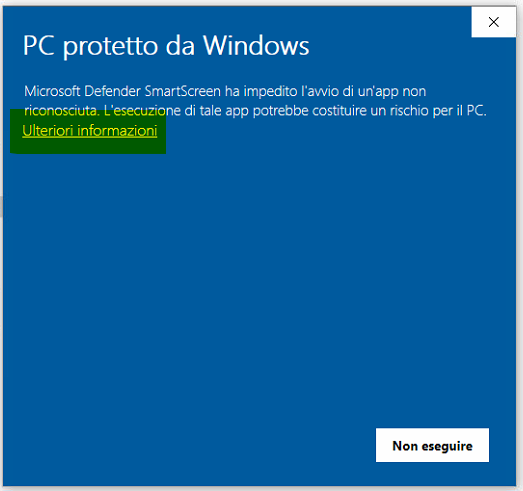
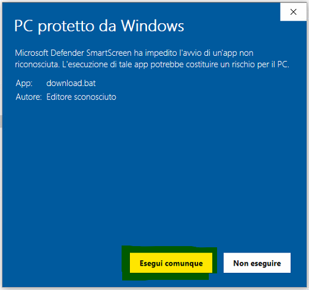
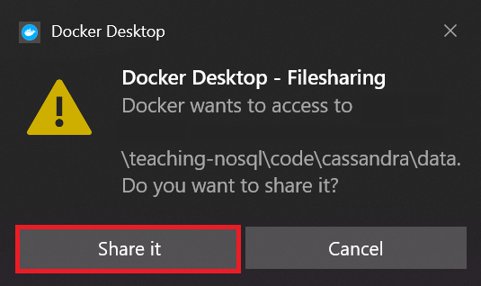
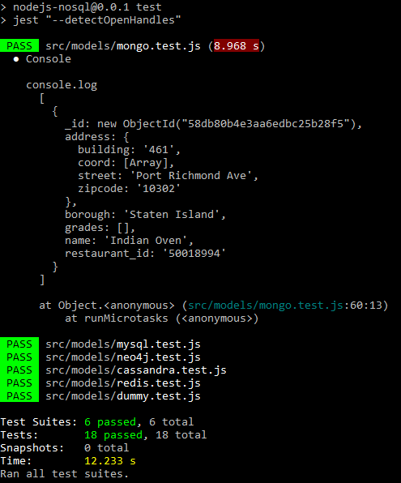

# NoSQL in Action!

NoSQL (Not Only SQL) exercises against relational, key-value, document, graph, and columnar databases.

## Install
- What we need?
    - Docker
    - NodeJS
    - Studio3T
    - Git
- How to install?
    - [Quick installation (only for Windows)](instructions/QuickInstall.md).
    - [Other way (also for Mac and Linux)](instructions/OtherInstall.md)
- Check all is installed:
    - `docker`: 
        - by opening "Docker Desktop" (search it in start, if is not already opened)
        - by opening a new terminal (cmd.exe in Windows) and running 
            > docker run hello-world 
    - `NodeJS`: by opening a new terminal (cmd.exe in Windows) and running 
        > node --version
        
        (e.g., the output should be v17.3.1)
    - `git`: by opening a new terminal (cmd.exe in Windows) and running 
        > git --version

        (e.g., the output should be v2.38)
- Run from a new terminal (cmd.exe in Windows and Terminal in Mac/Linux)
    >   
        cd Documents 
        git clone https://github.com/ChiaraFor96/fitstic-nosql-2024.git
- All the files will be in the folder Documents\fitstic-nosql-2024

## Running the software and download slides
- __***REMEMBER***: do not change (modify or delete) files in the directory "fitstic-nosql-2024"__, just copy a file changing the name for have your own version.

- Open a new terminal (cmd.exe in Windows and Terminal in Mac/Linux) and run the following commands:
    - Windows
        >
            cd Documents\fitstic-nosql-2024
            cd code
            .\start.bat
    - Linux / Mac
        > 
            cd Documents/fitstic-nosql-2024
            cd code
            sh start.sh
              
    __In both cases when you launch "start" script you can specify the name of the databases for reduce the number of executed processes.__
    - Cassandra:
        - .\start.bat cassandra cassandra-seed
    - Mongo:
        - .\start.bat mongodb mongodb-seed
    - Neo4J:
        - .\start.bat neo4j
    - Redis:
        - .\start.bat redis
    
    (for Linux/Max write "sh start.sh" instead of ".\start.bat")

If Windows complains about:
  - Running the scripts

    
    
    and then

    

  - Sharing directories

    

- If everything runs well, the result should be something like:

    

    - If some database is not up, because we start only some of them the test of the started databases must PASS, the others not.

## In case of errors
- Open a new terminal (cmd.exe in Windows and Terminal in Mac/Linux) and run the following commands:
    - Windows
        >
            git stash
            git pull
            cd Documents\fitstic-nosql-2024
            cd code
            .\clean.bat
    - Linux / Mac
        >
            git stash
            git pull
            cd Documents/fitstic-nosql-2024
            cd code
            sh clean.sh

    And retry with the start process (contact me at chiara.forresi@unibo.it for errors we can not manage to solve during the lectures).

## (Tentative) Calendar
- Lecture 09/04/2024 (9-13): Introduction to NoSQL databases (until slide 48) and start software installation
- Lecture 11/04/2024 (9-13): Introduction to NoSQL databases and software installation, Cassandra
- Lecture 16/04/2024 (9-13): [Test teoria](https://docs.google.com/forms/d/e/1FAIpQLScrbaTOh-Ga03Hj0XMFn1rUyvBDSW38CCAOYPdYAUk7Cj8S3w/viewform), Cassandra
- Lecture 17/04/2024 (9-13): Cassandra
- Lecture 22/04/2024 (9-13): [Test Cassandra](https://docs.google.com/forms/d/e/1FAIpQLSdlTx5rmdUhqjFuRIInEL-P-Oa2hBOWnPAwMQm75oiaU5YAvw/viewform), Neo4J
- Lecture 23/04/2024 (9-13): Neo4J, MongoDB Find
- Lecture 30/04/2024 (9-13): [Test Neo4J](https://docs.google.com/forms/d/e/1FAIpQLSfmmgYyoP0QyrN8099SNOyS-Y1J-DCoguGeV3tIVxvkH0N7dw/viewform), MongoDB Find
- Lecture 02/05/2024 (10-12): [Test MongoDB](https://docs.google.com/forms/d/e/1FAIpQLSfk6X738YlQb0GlXlsWqKDVE8SGJYdg3bx9FfO7B5kyjYZ1Lw/viewform), Approfondimenti Mongo
